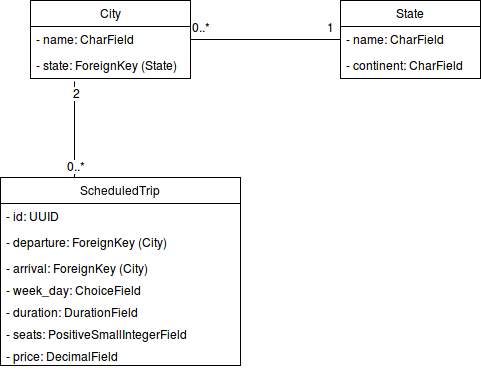
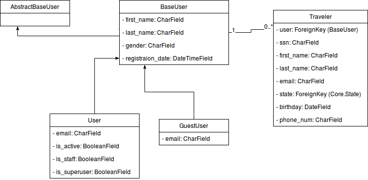
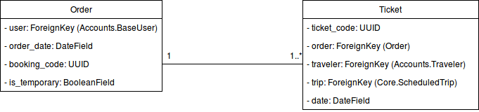
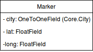
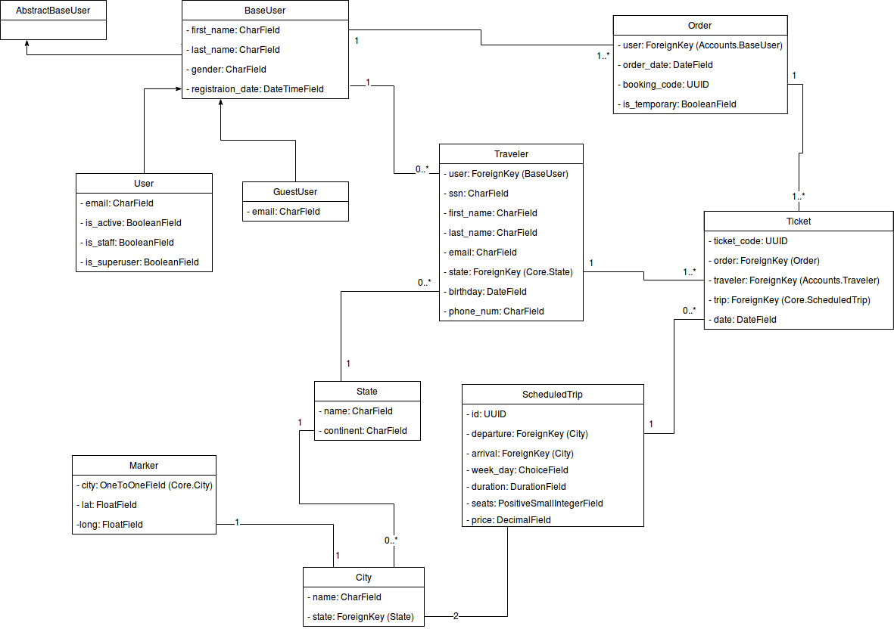

# Space X Tickets
Applicazione web per la ricerca e prenotazione di viaggi con l'innovativo sistema di volo creato dal visionario Elon
Musk.

## 0. Funzionalità
All'interno della home page è possibile effettuare una ricerca inserendo le città di partenza e arrivo, la data di
partenza, l’orario che può essere omesso e il numero di posti che si vogliono prenotare.

E' inoltre possibile effettuare una ricerca per un viaggio di sola andata oppure andata e ritorno selezionando i diversi
pannelli presenti nel widget di ricerca.

L'integrazione delle API Google nella sezione Mappe permette di visualizzare in quali di città del mondo è possibile
volare con questo servizio, inoltre cliccando su uno dei marker presenti nella mappa verranno visualizzate le tratte
disponibili dalla città selezionata.

E' presente la possibilità di registrarsi al sito in modo da mantenere in memoria e poter visualizzare lo storico degli
ordini effettuati e i dati dei viaggiatori per i quali sono stati acquistati i biglietti. In questo caso nel momento in
cui si effettua un acquisto è possibile selezionare i dati dei viaggiatori invece di inserirli nuovamente.

Il sito è inoltre localizzato sia in italiano che in inglese, la lingua è modificabile in fondo alla pagina a destra.

Tutto questo è stato modellato e pensato tenendo in mente che il sito deve poter essere utilizzato da qualsivoglia tipo
di dispositivo, tablet e smartphone inclusi (responsiveness).

## 1. Struttura del codice
Il codice dell'applicazione è stato suddiviso in **moduli** il più indipendenti possibile fra di loro per facilitare la
gestione degli errori e separare la logica applicativa.

I moduli presenti sono i seguenti:

* Core
* Accounts
* Search
* Order
* Gmaps
* Utils

## 2. Funzionalità dei moduli

### 2.1 Core
Contiene il modello relativo ai viaggi stessi, rappresentati tramite gli ScheduledTrip cioè viaggi programmati in un 
determinato giorno della settimana ad un certo orario.

Sono presenti inoltre modelli per rappresentare gli stati e le città che saranno utilizzati come chiavi esterne dei
viaggi per le stazioni di partenza e arrivo.

Le views presenti in questo modulo si occupano di visualizzare la home page del sito nella quale è incluso il widget di
ricerca e la pagina di about contenente le informazioni generali dell’applicazione.

### 2.2 Accounts
Contiene i modelli relativi ai diversi tipi di utente che il sito supporta.

Il modello di base è BaseUser che contiene le informazioni basilari che ogni tipo di utente deve avere, questo modello
sarà poi esteso dai due tipi principali che sono User e GuestUser.

User è l’utente registrato che può accedere al sito con le proprie credenziali ed ha accesso alla dashboard nella quale
può visualizzare e modificare le informazione del proprio account, la proprio password, le informazioni dei viaggiatori
che sono stati salvati e degli ordini effettuati.

GuestUser invece è un utente che viene creato nel momento in cui un utente non registrato vuole effettuare un acquisto e
decide di non volersi registrare. In questo caso vengono richieste le informazioni di base necessarie per completare
l’ordine.

In questo modulo sono presenti tutte le views necessarie alla gestione degli accounts e dei viaggiatori, con le quali è
possibile:

* registrare un nuovo utente
* modificare la informazioni dell’utente
* modificare la password dell’utente
* modificare i dati relarivi a un viaggiatore
* eliminare un viaggiatore salvato

\newpage
### 2.3 Search
E’ il modulo che per l’appunto si occupa della ricerca dei viaggi presenti all’interno del database ed è suddiviso in 2
views e un metodo che si occupa della ricerca vera e propria.

La view **search** si occupa sempre della ricerca del viaggio di andata utilizzando i dati inseriti dall’utente nel widget di
ricerca, una volta selezionato il volo il comportamento varia in base al tipo di viaggio che si vuole prenotare.

Se è un viaggio di sola andata si procederà alla conferma dell’ordine, mente se se è un viaggio con andata e ritorno si
viene reindirizzati alla view **search_return** che si occupa di mostrare i viaggi di ritono per poi successivamente procedere
all’ordine.

### 2.4 Order
Contiene i modelli relativi agli ordini e ai biglietti contenuti in essi.

E’ possibile effettuare un ordine per volta, cioè acquistare biglietti per un viaggio che sia solamente andata oppure
andata e ritorno per volta.

Inoltre si hanno 10 minuti di tempo per completare l’ordine in modo da non occupare posti
disponibili per troppo tempo.

Il procedimento di effettuazione di un ordine è diviso in 6 fasi:

1. **Confirm**: vengono visualizzate le informazioni dei viaggio che si sta prenotando. Se l’utente non è autenticato gli
viene data la possibilità di farlo, di registrarsi o continuare come ospite.
1. **Reserve**: vengono creati l’ordine contrassegnato come temporaneo con i dati dell’utente nel caso in cui sia
autenticato e i biglietti in modo da prenotare i posti per i 10 minuti in cui l’ordine temporaneo rimane valido.
1. **Step1**: se l’utente è già autenticato questa fase viene saltata in quanto in questo momento viene creato il GuestUser
con i dati inseriti dall’utente nel caso in cui abbia deciso di continuare come ospite.
1. **Step2**: viene aggiunto il riferimento al GuestUser se creato nella fase precedente e vengono richiesti i dati dei
viaggiatori dando la possibilità agli utenti registrati di selezionare dati già inseriti in passato e salvati nel
database.
1. **Step3**: vengono associati i dati dei viaggiatori ai biglietti creati nella fase Reserve e viene calcolato il costo
totale dell’ordine che sarà visualizzato nell’ultima pagina dove viene richiesto un pagamento (non implementato).
1. **Finalize**: ultima fase nella quale si contrassegna l’ordine come non temporaneo e si visualizza la pagina con i
dettagli dell’ordine appena completato.

### 2.5 Gmaps
E’ un modulo dedicato alla visualizzazione della mappa.

Contiene il modello **Marker** nel quale si associa ad un città, chiave esterna del modello presente in Core, la sua
posizione geografica specificata attraverso latitudine e longitudine. 

### 2.6 Utils
Modulo contenente funzioni utilizzate all’interno dell’applicazione.

Tra cui la pagina di errore **BadBoy** visualizzata nel caso in cui l’utente provi a compiere azioni non consentite o per le
quali non ha i permessi necessari o gli **Encoder** e **Decoder** Json personalizzati per poter salvare tipi di dato che non
sarebbero serializzabili altrimenti.

\newpage
## 3 Modelli && Diagrammi UML

### 3.1 Core

\
È importante notare come `ScheduledTrip` **non** contenga la data, questo modello rappresenta, infatti, un viaggio
**programmato** non un'istanza di viaggio.

Il campo `seats` contiene quindi il **numero massimo** di posti a sedere.

### 3.2 Accounts
\
Abbiamo reimplementato la classe `AbstractUser` per derivarne poi due, `User` e `GuestUser`, il primo avente il campo
**email** unico mentre il secondo no.

Il `GuestUser` ha come `Traveler` collegati quelli che vengono aggiunti in fase di completamento dell'ordine.

Nel caso in cui l'ordine non venga completato in tempo, o l'utente decida di effettuarne un'altro, il `GuestUser` e
tutti i suoi `Travelers` associati verranno cancellati.

Una limitazione di come abbiamo implementato `Traveler` è che la nazionalità deve essere presente nel database. D'altro
canto questa scelta di design ci permette di avere meno ridondanza nel database e più consistenza.

\newpage
### 3.3 Orders
\
Modello utilizzato per rappresentare un ordine.

E' in questo modello che possiamo identificare l'istanza di un viaggio che è rappresentata da uno `ScheduledTrip` in
una specifica `date`, saranno quindi utilizzati i `Ticket` per controllare i posti disponibili per un certo viaggio.

Nel momento in cui un utente conferma una ricerca, viene creato un `Order` con il field `is_temporary` a `True`, quest'
ultimo verrà settato a `False` nella fase di **Finalize** dell'ordine.

In questo modo è possibile eliminare gli ordini che non sono stati finalizzati una volta scaduto il tempo disponibile
per il completamento dello stesso o attraverso l'apposito script (approfondimento più avanti).

### 3.4 Gmaps
\
Struttura utilizzata per rappresentare i `Marker` sulla mappa.

Abbiamo deciso di svincolare il modello `City` da `lat` e
`long` e di utilizzare un modello apposito per avere maggiore modularità e query più leggere per la ricerca dei viaggi.

Le tratte (che vengono visualizzate quando si clicca su un `Marker`) vengono generate a runtime in base ai dati presenti
in `ScheduledTrip`.

In uno scenario realistico potrebbe essere necessario implementare un sistema di cache per attutire i costi
computazionali dovuti dalla generazione dinamica delle tratte.

### 3.5 Schema riassuntivo
\
Schema complessivo del modello dell'applicazione

## 4. Pannello Staff
Per i pannelli di admin e staff è stato utilizzato quello fornito da Django debitamente personalizzato.

I permessi di accesso alle varie parti del pannello di controllo per i membri dello staff dovranno essere definite dagli
admin attraveso l'assegnazione di **permessi** specifici per ogni membro oppure tramite la creazione di **gruppi** se necessario.

Questo è possibile dall'**admin panel** se acceduto da un superutente grazie alla sezione **Groups** e alla possibilità
di assegnare i permessi/gruppi durante il processo di modifica e creazione di un utente.

È possibile accedere al pannello staff, cliccando sul proprio nome e cliccando quindi `Admin Panel`.

## 5. Unit Testing
### 5.1 Testing su codice interno
E' stato realizzato sulla function `delete_order` del modulo **Order** che si occupa di eliminare un ordine e copre i seguenti casi:

* _Eliminazione di un ordine:_ controlla che l'ordine venga effettivamente eliminato dal database
* _Eliminazione dei Tickets:_ controlla che vengano eliminati dal database i tickets che fanno parte dell'ordine
* _Eliminazione del guestUser:_ controlla che se all'ordine è associato un guestUser questo venga eliminato nel momento
in cui viene eliminato l'ordine in quanto utile solo ad esso
* _Eliminazione dei Traveler:_ controlla che vengano eliminati i Traveler associati ai biglietti nel caso in cui l'ordine
sia stato effettuato da un guestUser
* _Non eliminazione dei Traveler:_ controlla che **non** vengano eliminati i Traveler associati ai biglietti nel caso in 
cui l'ordine sia effettuato da uno User registrato, in modo tale da poterli tenere in memoria e riutilizzare le
informazioni inserite in ordini futuri

### 5.2 Testing su view
E' stato realizzato sulla view del modulo **Search** che si occupa della ricerca dei viaggi e controlla che ritorni 
il messaggio **No trips found** nei seguenti casi:

* Ricerca di un viaggio non presente nel database
* Ricerca di un viaggio con data di ritorno minore di quella di partenza
* Ricerca di un viaggio con data di partenza nel passato
* Ricerca di un viaggio in data ordierna con l'orario nel passato
* Ricerca di un viaggio inserendo **zero** come numero di posti da prenotare

E' stato inoltre testato che vengano ritornati i corretti codici di risposta nei casi di richesta:

* GET (302 `HTTP_REDIRECT`) 
* POST (200 `HTTP_OK`)

\newpage
## 6. Localizzazione
La localizzazione dei modelli dell'applicazione è stata realizzata utilizzando l'applicazione esterna 
**django-modeltranslation** mentre per le parti restanti è stato utilizzato il sistema di internazionalizzazione
fornito da django.

I messaggi da tradurre vengono creati utilizzando da shell il comando `manage.py makemessages` e salvati nel file 
**django.po** all'interno della cartella **locale** del progetto. Nello stesso file sono specificate
le traduzioni delle stringhe selezionate le quali verranno caricate nel database tramite il comando `manage.py compilemessages`.

## 7. Automatizzazione via scripts
E' stato realizzato un sistema di scripting posizionati nella cartella **scripts** del progetto che permettono di:

* Popolare il database (`populare-db`)
* Fare un refresh della popolazione del database (`refresh-db`)
* Creare un superuser (`create-super-user`)
* Eliminare lo stesso superuser (`delete-super-user`)
* Eliminare l'intero contenuto del database (`drop-db`)
* Navigare all'interno del del database attaverso **sqlitebrowser** (`browse-db`)

Inoltre è presente lo script `clean-db` nella root directory del progetto che se eseguito periodicamente (ed esempio
utilizzando cron) permette di eliminare gli ordini temporanei dal database.

## 8. Software utilizzato
Per la realizzazione di questo progetto è stato utilizzato il seguente software:

* Python
* Django
* django-modeltranslation
* Bootstrap
* JQuery
* Flag-Icon css
* Popper js
* bash

## 9. Autori
* [Jacopo Scannella](https://github.com/antipatico)
* Alessio Lei

## 10. Ringraziamenti
Ringraziamo con immenso amore i nostri genitori, che ci sostengono con spropositato amore nelle scelte fatte durante la
nostra vita, i professori per le conoscenze trasmesse e la pazienza versata e la community Free Open Source per tutto il
software codato.
